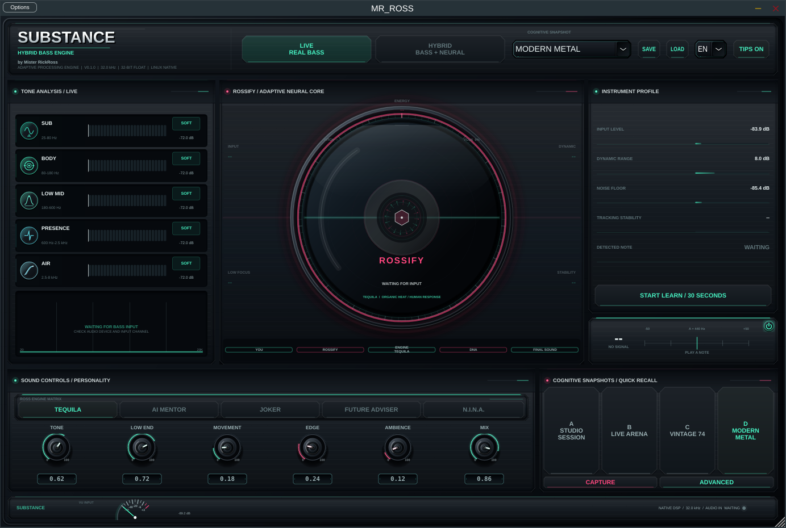
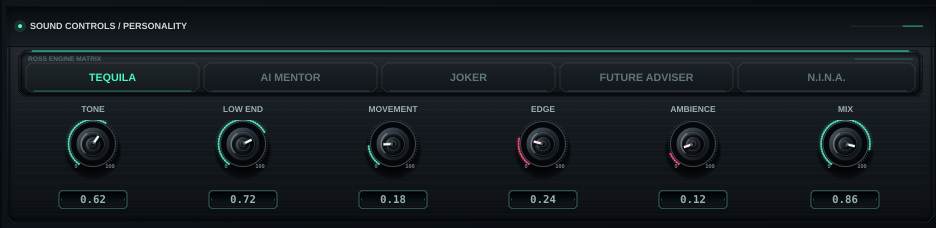
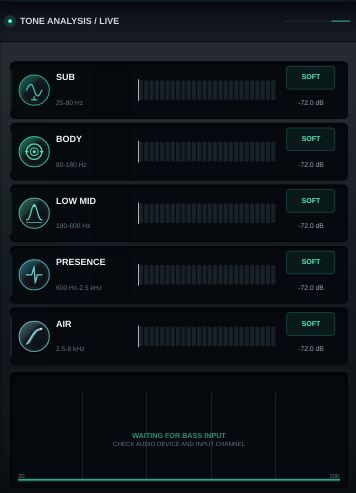

# SUBSTANCE
### HYBRID BASS ENGINE

Bass plugin in C++ with JUCE. VST3 and Standalone, Windows and Linux.

The real bass stays at the center of the signal. What changes is that you stop
hunting for the right parameter and start choosing a sonic personality, and the
engine translates that intent into a processing chain you can still open and
edit underneath.

Made by a bass player: Ricardo Rossati, Mister RickRoss, 28 years playing, School
of Rock teacher, television, radio and stages across Brazil.

**[Download and full description](https://misterrickross.com/substance/)** ·
[Manual in Portuguese (PDF)](docs/MANUAL_SUBSTANCE_PT-BR.pdf) ·
[Leia em português](README.pt-BR.md)



## What it actually does

Your bass goes in. The plugin measures how that specific instrument responds,
and expands the tone around what you already play.

- **Learn Tone** listens to 30 seconds of real signal, silence does not count,
  and keeps a spectral profile of your instrument
- **Bass Vision** shows five musical regions, so you see what you are hearing
- **Five band graphic EQ**, plus or minus 12 dB, aligned to those same regions
- **Monophonic tracking** by autocorrelation, with a chromatic tuner that can be
  switched off without disabling the internal tracking
- **Synthesized sub and octaver** with attack preservation
- **Cabinet IR**, five internal cabinets or your own WAV
- **Cognitive Snapshots**, factory library plus four capture and recall slots
- Full chain: `OCTAVE → DRIVE → WAH FILTER → CHORUS → SYNTH LAYER → AMBIENCE → CAB IR → EQ`

## The five engines

This is the part that is not a preset with a different name. Each engine is a
different behavior.

| Engine | What it does |
|---|---|
| **Tequila** | Asymmetric valve, magnetic memory, body, sag, centered image |
| **AI Mentor** | Clean leveling, protected attack, controlled air, mix ready image |
| **Joker** | Preserved attack and four deterministic gestures, Bite, Drop, Squawk and Fracture, fired by how you play |
| **Future Adviser** | Firm mono low end, harmonic glass, its own bass safe stereo field |
| **N.I.N.A.** | Slow adaptive correction in opposite directions for dark or bright sources, deepened by the learned profile |

Six personality macros sit on top: Texture, Weight, Motion, Chaos, Space and
Blend. Blend is the only global dry and wet crossfade.

**ROSSIFY** reads the current measurements and adapts the chain to them. In
Manual, every control stays fully yours.



## How the engines were verified

The project ships an offline renderer that feeds the same groove and one
isolated note to all five engines and compares the results. A build is only
accepted when it passes all of this:

- 10 out of 10 distinct engine pairs, in both scenarios
- 30 out of 30 macro responses
- Calibrated loudness across engines
- Safe DC offset
- Joker determinism, the same performance produces the same gestures
- Bass safe stereo on Future Adviser
- Correct polarity adaptation on N.I.N.A.

The test runs under `ctest`. This is what keeps five engines from quietly
becoming one engine with five labels.

## Free and Pro

The first launch offers a **15 day Pro trial**, no card required. After it ends,
audio keeps working in Free.

- **Free** keeps the core sound, LIVE processing, tooltips and factory snapshots
- **Pro** unlocks HYBRID, Advanced and DNA, user presets and the complete module set

Pro is **US$ 59** by card, or **R$ 297** in Brazil by Pix or card. A lifetime
license, not a subscription, with 1.x updates included. One license
activates on up to two computers. Buy it at
[misterrickross.com/substance/en/checkout](https://misterrickross.com/substance/en/checkout/);
the key arrives by e-mail right after payment.

## Install

### Windows

Download `SUBSTANCE-Setup.exe` from
[Releases](https://github.com/RickRossati/substance/releases/latest) and run it.
The VST3 goes to `Program Files\Common Files\VST3`. Rescan VST3 in your DAW
afterwards.

The installer is not code signed yet, so Windows may show "Windows protected
your PC". Click "More info", then "Run anyway".

### Linux

```bash
tar xzf SUBSTANCE-Linux-x86_64.tar.gz
cd SUBSTANCE-Linux-x86_64
./install.sh
```

Installs the VST3 to `~/.vst3` and the standalone alongside it.

### Quick setup

1. Plug the bass into your interface
2. Open SUBSTANCE on an audio track
3. Play hard and raise **INPUT** without clipping
4. Confirm **AUDIO IN / ACTIVE** in the footer
5. Run **Learn My Bass** once, then pick an engine



## What is not there yet

Stated plainly, so nobody buys on a promise:

- **macOS**, on the roadmap, not released
- **Code signing** on the Windows installer, so SmartScreen warns on first run
- **Real sample layer** for finger, pick, mute and slide
- **Multiband compressor and oversampling**
- Long term multi session training for N.I.N.A.

## Source code

The source is not public. This repository is the product page, the release
channel and the issue tracker.

Bug reports, crash logs and DAW compatibility reports are genuinely welcome in
[Issues](https://github.com/RickRossati/substance/issues), and are the fastest
way to get something fixed.

## Support

[Support page](https://misterrickross.com/substance/support.html) ·
[Refund policy](https://misterrickross.com/substance/refund.html) ·
[Privacy](https://misterrickross.com/substance/privacy.html)

To move a license between machines, support can reset one activation after
verifying the purchase.

## License

Proprietary. See [LICENSE.txt](LICENSE.txt).

The plugin may be freely downloaded and used under the Free tier. What is not
allowed is sharing license keys, removing activation, or redistributing the
plugin or installer as your own product.

Built with [JUCE](https://juce.com) 8.

---

© 2026 Ricardo Rossati, Mister RickRoss · Ross Audio
